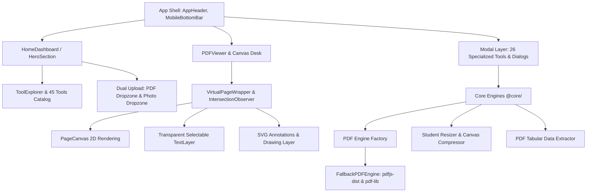

# System Architecture

**Analysis Date:** 2026-09-23
**Project:** JustPDFCraft

## Architectural Overview

JustPDFCraft is an offline-capable, local-first web application designed for comprehensive PDF manipulation, exam admission document preparation, and handwriting synthesis.

## Architectural Layers

### 1. Presentation & Shell Layer (`src/components/app-shell/`)
- `AppHeader.tsx`: Navigation bar, mode switcher, document title, zoom controls, tool buttons, theme toggler.
- `MobileBottomBar.tsx`: Responsive quick-action bar for mobile devices.
- `CommandPalette.tsx`: Global search & command palette (`Ctrl + K` / `Cmd + K`).

### 2. Dashboard & Home Layer (`src/components/home/`)
- `HomeDashboard.tsx`: Primary landing surface when no document is active.
- `HeroSection.tsx`: Dual dedicated dropzones:
  - **PDF Documents Workspace**: `.pdf` file drop and `Browse Document` button.
  - **Photos & Images Workspace**: Image file drop, `Browse Photo` button, and Exam Resizer shortcuts.
- `ToolExplorer.tsx`: Instant category navigation (PDF Tools, Image Tools, Student Suite, Exam Suite).
- `ToolCard.tsx`: AMOLED black interactive tool cards.

### 3. Viewer & Canvas Desk (`src/components/viewer/`)
- `PDFViewer.tsx`: Multi-page virtualized desk supporting `single`, `continuous`, `spread`, and `organize` view modes.
- `VirtualPageWrapper`: Uses `IntersectionObserver` with 600px buffer to dynamically mount/unmount pages off-screen.
- `SelectionHUD.tsx`: Floating context menu when text is selected (Copy, Highlight, Underline, Search, Read Aloud).
- `PresentationOverlays.tsx`: Laser pointer and presentation markup.

### 4. Specialized Tool Modals (`src/components/dialogs/`)
26 dedicated dialogs including:
- `StudentToolsDialog.tsx`: 4 tabs (Exam Resizer, Joint Photo/Sign Combiner, Paper Signature Cleaner, DOP Name/Date Strip).
- `PhotoEditorDialog.tsx`: Crop, passport aspect ratio, color filters, rotate, flip.
- `CompressDialog.tsx`, `MergeDialog.tsx`, `SplitDialog.tsx`, `SignDialog.tsx`, `BatesNumberingDialog.tsx`, etc.

### 5. Core Engine Layer (`core/`)
- `core/pdf/engine.factory.ts`: Singleton engine provider.
- `core/pdf/engines/fallback-engine.ts`: Implementation combining PDF.js and pdf-lib.
- `core/image/student-resizer.ts`: Binary search JPEG compression to exact KB target (e.g. 20–50 KB for SSC/UPSC).
